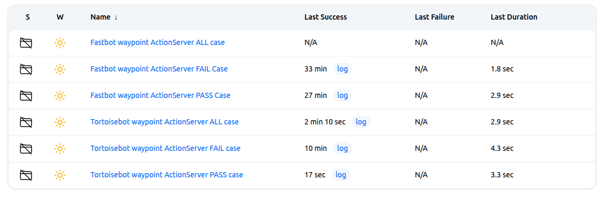
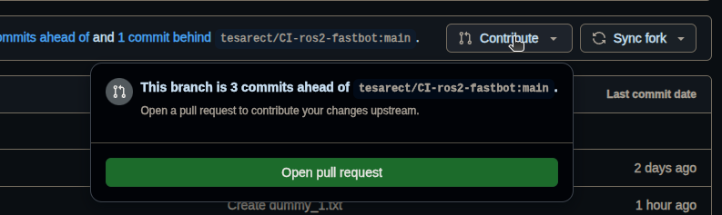
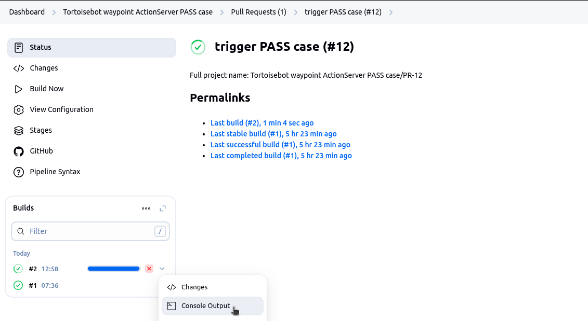
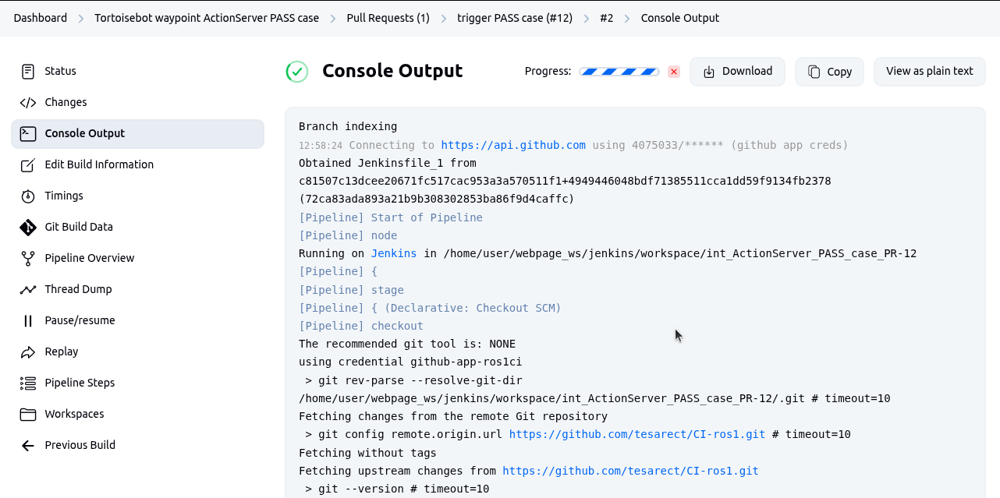

# ROS1 CI — Checkpoint 24 Task 1

## Overview
Jenkins CI pipeline that triggers on GitHub Pull Requests, builds a Docker image with ROS Noetic + TortoiseBot, runs Gazebo simulation + waypoints tests inside the container, and reports results back to GitHub.

---

## Repository Structure

| File | Purpose |
|---|---|
| `Dockerfile` | ROS Noetic + Gazebo + waypoints image |
| `Jenkinsfile` | Pipeline: pass case — build image → run Gazebo → run tests |
| `Jenkinsfile_failcase` | Pipeline: fail case — pipeline goes RED on test failure |
| `Jenkinsfile_1` | Pipeline: pass case — pipeline always GREEN, result in console |
| `Jenkinsfile_1_failcase` | Pipeline: fail case — pipeline always GREEN, result in console |
| `Jenkinsfile_allcase` | Pipeline: runs both pass and fail cases as sequential stages |
| `jenkins-infra/scripts/jenkins_bootstrap.sh` | Installs + starts Jenkins each session |
| `jenkins-infra/scripts/install_plugins.sh` | Installs Jenkins plugins (run once) |
| `jenkins-infra/jenkins/plugins.txt` | Pinned plugin list for Jenkins 2.504.3 |

---

## Docker Image

DockerHub: `tesarect/karthikeyanbalasubramanian-cp22:tortoisebot-noetic-gazebo-v1`

```bash
# Build
cd ~/simulation_ws/src/ros1_ci
docker build -t tortoisebot-noetic-gazebo:latest .

# Tag and push
docker tag tortoisebot-noetic-gazebo:latest tesarect/karthikeyanbalasubramanian-cp22:tortoisebot-noetic-gazebo-v1
docker push tesarect/karthikeyanbalasubramanian-cp22:tortoisebot-noetic-gazebo-v1
```

---
## Instructions (For Evaluation)

### Start jenkins server

> [ ⚠️ Warning ]
Consider the images below as just reference. Pipeline names (Tortoisebot / Fastbot) will be interchanged in the images 

```bash
cd ~/simulation_ws/src/ros1_ci

# Install / start jenkins server
bash jenkins-infra/scripts/jenkins_bootstrap.sh

# Install Jenkins Plugins
bash jenkins-infra/scripts/install_plugins.sh
```
> [Note]
Installations are persistent on the cloud for every session, so just starting the server might be sufficient.


### Switching Between Pass and Fail Test Cases Pipelines

Once logged into Jenkins with `admin` (_password: **admin**_) privilege, on the dashboard you can see 3 different pipelines all being disabled.

| Pipeline Name | Purpose |
|---|---|
| `Tortoisebot Waypoint ActionServer FAIL case` | Runs only Fail test case |
| `Tortoisebot Waypoint ActionServer PASS case` | Runs only Pass test case |
| `Tortoisebot Waypoint ActionServer ALL case` | Runs both Pass & Fail test case in 2 `stages` |




`Enable` one of the pipelines having `PASS` / `FAIL` / `ALL` case for TortoiseBot through the config


Click Apply & Save, then check if the pipeline has picked up the changes from the repo


### Raise a `Pull Request`
Fork this repo's `main` and add a dummy text file under the `dummies` folder inside the repo


Commit the changes and initiate a PR




### Watch for Build being Triggered
Once the PR gets accepted, you can see the pipeline getting triggered


also watch the jenkins build & console

> [Note] If the build doesn't appear on the list of builds or build history, `Refresh` the page to see if a new build appears under `pipeline > status` / `pipeline > Pull Request (tab)`


Look out for new builds (Note: Refresh the page if it doesn't appear)





In the `console output`, when the container starts, switch to TheConstruct page to see gazebo getting started and TortoiseBot moving towards goal.

In your GitHub PR page you should see the same


## Closing Note

once pipeline gets completed, `Disable` the pipeline

